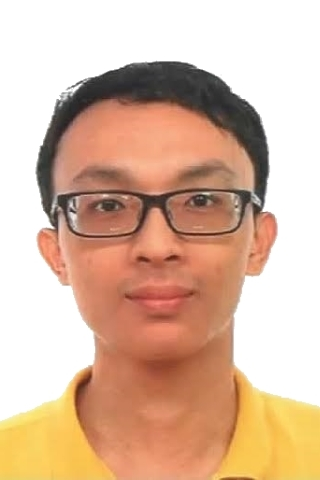
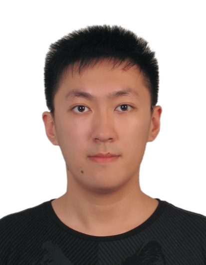

# About Us

We are a team based in the [School of Computing, National University of Singapore](http://www.comp.nus.edu.sg).

## Project Team

#### [Ngin Yun Chuan](https://github.com/nginyc)  
 
Role: Team lead    
Responsibilities: Logic

-----

#### [Conan Kian Jia Ren](https://github.com/ckjr)
 
Role: UI designer    
Responsibilities: UI

-----

#### [Sheng Xuan](https://github.com/Sheng-Xuan) 
 
Role: Integration    
Responsibilities: Storage

-----

#### [Song Zhiwen](https://github.com/zzzzwen) 
 
 * Components in charge of: Model
 * Aspects/tools in charge of:Testing
 * Features implemented:
 	* ToDo model
 	* Undo and Redo command
 	* Gui testing
 	* Non-gui testing
 * Other major contribution:
 	* Developer guide appendices formatting
 
 -----

# Contributors

We welcome contributions.